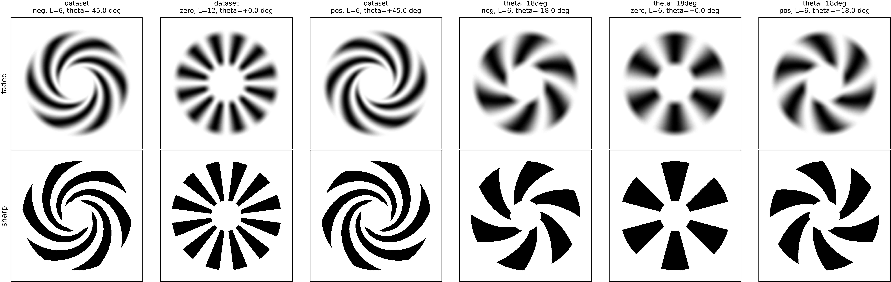
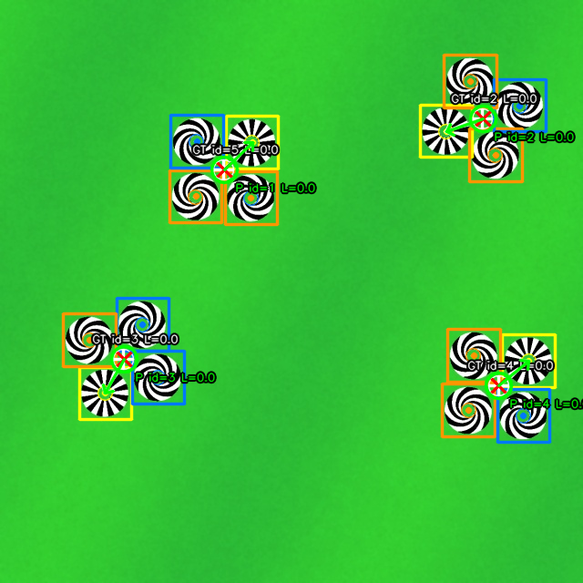
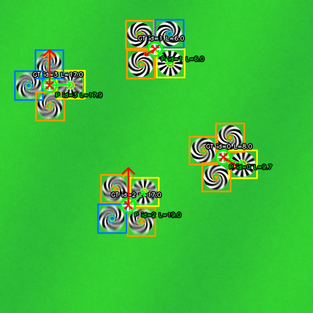
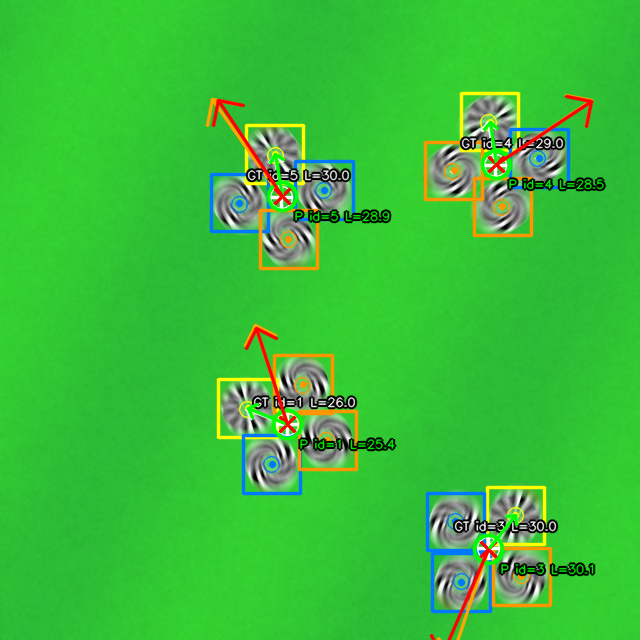
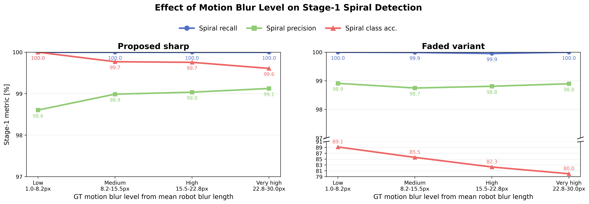
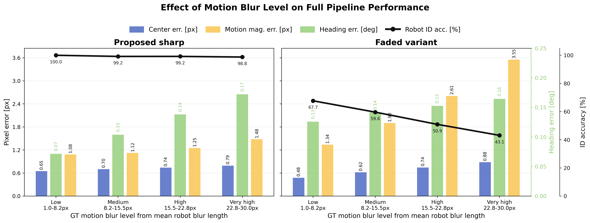
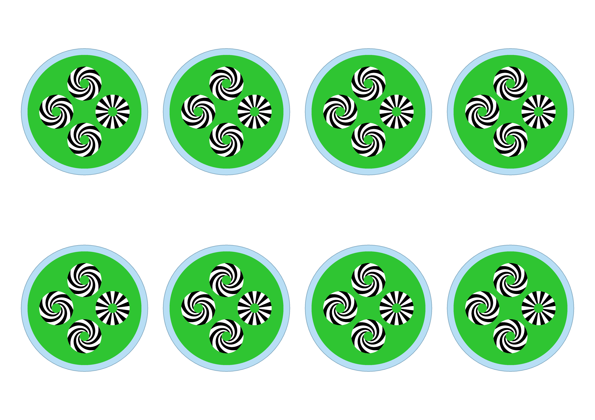

# Spiral Blur Markers

Sharp log-spiral robot markers with a two-stage perception pipeline for robot detection, ID decoding, pose recovery, and motion-blur reasoning.

This repository contains the final release version used in our paper. It includes the sharp spiral design, the RT-DETR Stage 1 detector, the geometry-aware Stage 2 blur reasoner, paper figures, and a small sample dataset pack for reproducibility and quick testing.

## Why This Repo

Conventional robot markers degrade quickly under fast motion because blur destroys the local structure needed for decoding. Our approach uses high-contrast sharp log spirals that remain detectable under strong motion blur and also expose blur cues that can be learned.

The final pipeline has two stages:
- Stage 1 uses RT-DETR to detect spiral instances and classify them as `neg`, `zero`, or `pos`.
- Stage 2 groups the detected spirals into four-slot robot hypotheses, canonically aligns them, and predicts robot ID, center, heading, blur direction, and blur magnitude with shared patch encoders and a lightweight transformer.

## Visual Overview

### Marker primitives



### Qualitative predictions

| Clean | Low / Medium Blur | High Blur |
|---|---|---|
|  |  |  |

### Blur sensitivity

| Stage 1 | Full pipeline |
|---|---|
|  |  |

### Real-sheet preview



## Final Release Contents

This repo is intentionally trimmed to the files used by the final sharp version:

- `configs/rtdetr_l_spiral_p5_n.yaml`
  Final Stage 1 detector configuration.
- `scripts/generate_p4_ai_dataset_sharp_replay.py`
  Sharp dataset generation from the final paper-v4 layout.
- `scripts/train_p4_rtdetr_detector_stable.py`
  Stable Stage 1 RT-DETR training launcher.
- `scripts/train_p4_grouped_blur_estimator_v2_from_stage1.py`
  Final Stage 2 training script aligned to Stage 1 predictions.
- `scripts/eval_p4_ai_pipeline_group_blur_v2.py`
  Full final evaluation for the sharp two-stage pipeline.
- `scripts/export_p4_ai_blur_samples_group_blur_v2.py`
  Paper-style synthetic qualitative overlays.
- `scripts/export_real_tests_paper_style.py`
  Paper-style overlays for real images.
- `src/spiral_markers/`
  Core synthesis, rendering, grouping, canonical alignment, and Stage 2 model code.
- `sample_data/`
  Small sharp validation sample pack with images, YOLO labels, and full scene metadata.

## Repository Layout

```text
spiral-blur-markers/
|-- configs/
|-- docs/assets/
|-- sample_data/
|-- scripts/
`-- src/spiral_markers/
```

## Installation

Create a Python environment with Python 3.10 or newer, then install the dependencies:

```bash
pip install -r requirements.txt
```

For GPU runs, install a CUDA-compatible PyTorch build first, then:

```bash
pip install -r requirements-gpu.txt
```

## Quick Start

### 1. Generate the sharp dataset

```bash
python scripts/generate_p4_ai_dataset_sharp_replay.py
```

### 2. Train Stage 1

```bash
python scripts/train_p4_rtdetr_detector_stable.py \
  --dataset-root outputs/p4_ai_dataset_v1_sharp \
  --model configs/rtdetr_l_spiral_p5_n.yaml \
  --epochs 50 \
  --imgsz 640 \
  --batch 12 \
  --device 0
```

### 3. Train Stage 2

```bash
python scripts/train_p4_grouped_blur_estimator_v2_from_stage1.py \
  --data-root outputs/p4_ai_dataset_v1_sharp \
  --train-split-file outputs/p4_ai_dataset_v1_sharp/train_70.txt \
  --val-split-file outputs/p4_ai_dataset_v1_sharp/val_30.txt \
  --detector-weights outputs/stage1_detector_ablation/train/rtdetr_l_spiral_p5_n/weights/best.pt \
  --device 0
```

### 4. Evaluate the full pipeline

```bash
python scripts/eval_p4_ai_pipeline_group_blur_v2.py \
  --data-root outputs/p4_ai_dataset_v1_sharp \
  --split-file outputs/p4_ai_dataset_v1_sharp/val_30.txt \
  --detector-weights outputs/stage1_detector_ablation/train/rtdetr_l_spiral_p5_n/weights/best.pt \
  --blur-weights outputs/p4_ai_group_blur_train_v2_stage1/p4_grouped_blur_v2_stage1_rtdetr_l_p5_best.pt \
  --device 0
```

### 5. Run on real images

```bash
python scripts/export_real_tests_paper_style.py \
  --image-dir real-tests \
  --device 0 \
  --imgsz 640 \
  --no-resize \
  --conf 0.10 \
  --min-stage1-conf 0.60
```

## Implementation Notes

- Geometric grouping is implemented in `src/spiral_markers/ml/p4_ai_inference.py`.
- Canonical slot alignment and crop construction are implemented in `src/spiral_markers/ml/p4_grouped_blur_estimator.py`.
- The final Stage 2 transformer model is implemented in `src/spiral_markers/ml/p4_grouped_blur_estimator_v2.py`.
- The final Stage 2 loss function is implemented in `scripts/train_p4_grouped_blur_estimator_v2_from_stage1.py`.

## Results Snapshot

On the final sharp validation setup, the full pipeline achieved:

- `100.0%` robot recall
- `100.0%` robot precision
- `99.34%` ID accuracy on the full validation set
- `99.22%` ID accuracy on blurred samples
- `19.64°` blur direction error on blurred samples
- `1.20 px` blur magnitude error on blurred samples

The sharp spiral design consistently outperformed the faded design and the classical baseline, especially on blur-heavy scenes where spiral class stability directly affects robot ID and motion reasoning.

The repository ships figures and a small sample dataset pack. Full trained weights and the complete dataset are not bundled in this initial public release.

## Citation

If you use this code or the sample dataset in your research, please cite the accompanying paper. We will update this section with the final BibTeX entry for the camera-ready release.

## Acknowledgment

The marker center remains hollow by design, so conventional color markers can still be embedded for backward-compatible validation with existing robot-marking systems during transition experiments.
